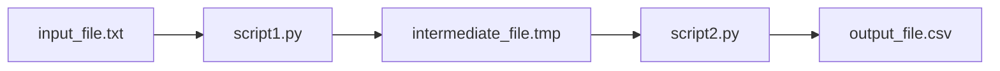

# Figure X: [Figure Title]

Brief description of the figure and its significance.

## Software Requirements

- Software 1 (version x.x.x)
- Software 2 (version x.x.x)
- Programming language (version x.x.x)

## Installation

```bash
git clone [subrepo URL]
cd [subrepo directory]
pip install -r requirements.txt
```

## Usage

```bash
python script.py
```

## Input files

`input_file.txt` [Description]

## Output files

`output_file.txt` [Description]

## Intermediate files

`intermediate_file.tmp` [Description]

## File relationships



## Runtime
Typical runtime: X minutes
